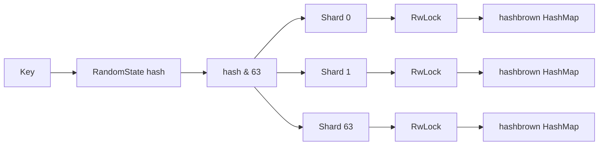

# Aether Cache

Aether Cache is a Rust-based concurrent, in-memory cache core designed for analytical workloads with high read parallelism, predictable lock contention, and low-copy binary payload handling. Its current foundation consists of a 64-way sharded hash table and a compact cache-entry representation with optional TTL metadata and atomic access accounting.

> **Project status:** early-stage infrastructure. Sharding, entry representation, and concurrency stress tests are implemented. Public cache operations, expiration enforcement, eviction policy, capacity accounting, and persistence are not yet part of the API.

## Architecture Overview

Aether Cache partitions its key space across exactly 64 independent shards. Each shard owns a `hashbrown::HashMap<K, V>` guarded by its own `parking_lot::RwLock`; there is no cache-wide lock on the data path.



For a key $k$, routing is computed as:

$$
\operatorname{shard}(k) = \operatorname{hash}(k) \mathbin{\&} (64 - 1)
$$

Because 64 is a power of two, the bit mask replaces a modulo operation while preserving an index in the range $[0, 63]$. A per-cache `RandomState` supplies randomized hashing, and equal keys route consistently for the lifetime of one cache instance.

The shard collection is allocated once as a contiguous boxed slice. This keeps the owning `ShardedCache<K, V>` small while maintaining a fixed shard count and stable shard addresses. `hashbrown::HashMap` provides a high-performance SwissTable-style implementation with cache-efficient metadata probing.

The entry representation uses `#[repr(C)]` and contains:

- Immutable `bytes::Bytes` handles for the key and value.
- An optional absolute expiration timestamp in Unix epoch milliseconds.
- An `AtomicU32` access counter initialized to zero.

TTL construction uses saturating timestamp arithmetic. If the system clock is before the Unix epoch, the constructor fails open by creating a non-expiring entry instead of risking immediate accidental eviction.

## Concurrency Model

Each `CacheShard<K, V>` owns an independent `parking_lot::RwLock<HashMap<K, V>>`. Operations contend only when their keys map to the same shard:

- Multiple readers may access one shard concurrently.
- A writer receives exclusive access to one shard.
- Readers and writers on unrelated shards proceed independently.
- No global mutex serializes the full cache.

`parking_lot::RwLock` is used instead of `std::sync::RwLock` for its compact representation, efficient parking behavior under contention, and non-poisoning semantics. A panic while holding a write guard does not permanently poison the shard; callers remain responsible for maintaining logical invariants around multi-step mutations.

`CacheShard` is declared with `#[repr(align(64))]`. Rust therefore gives every shard at least 64-byte alignment and rounds its object size to an alignment-compatible multiple. Adjacent shard locks cannot occupy the same conventional 64-byte hardware cache line, reducing false sharing caused by lock-state updates from different CPU cores.

The lock guards are synchronous. They should be held only for the shortest map operation and must not be retained across `.await` points. As in Python, a write operation still requires exclusion; unlike a Python dictionary commonly protected by one process-wide lock, this design permits genuine parallel access across independent shards.

The test suite includes a stress test that launches 16 native threads. Each thread inserts 10,000 unique `String` key-value pairs, after which the aggregate size of all shards must be exactly 160,000 entries.

## Memory Management

Payloads use `bytes::Bytes`, an immutable, reference-counted byte buffer designed for inexpensive sharing across threads:

- Moving a `Bytes` value into a cache entry transfers only its handle.
- Cloning a `Bytes` handle increments the shared allocation's reference count; it does not copy payload bytes.
- Slices can share the original backing allocation without allocating or copying the selected payload region.
- The backing allocation is released when the final handle is dropped.

This differs from copying a Python `bytes` slice, which ordinarily creates a new byte object and duplicates the selected data. The Rust ownership model makes sharing explicit: borrowed access can avoid even a handle clone, while a cloned `Bytes` handle provides independently owned access to the same immutable storage.

The sharded map introduces one initial allocation for the boxed shard collection. Individual `HashMap` tables allocate independently as entries are inserted, so growth and rehashing in one shard do not relocate or block other shards. Cache-line alignment intentionally trades a small amount of padding for lower coherence traffic under multicore contention.

The access counter is an atomic field rather than a lock-protected integer. Atomics permit concurrent metadata updates without acquiring the shard write lock; the exact ordering and saturation policy will be defined alongside the eviction implementation.

## Setup Instructions

### Prerequisites

- Rust 1.85 or newer, required for Rust Edition 2024.
- Cargo, installed with Rust through [rustup](https://rustup.rs/).
- Git for source control.

Confirm the toolchain:

```console
rustc --version
cargo --version
```

### Create the library from scratch

To reproduce the initial project layout in a new directory:

```console
cargo new aether-cache --lib --vcs git
cd aether-cache
cargo add tokio --features full
cargo add bytes
cargo add parking_lot
cargo add hashbrown
cargo add crossbeam-queue
```

Do not run `cargo new` inside an existing checkout.

### Build and validate

From the crate root:

```console
cargo fmt --check
cargo check --all-targets
cargo clippy --all-targets --all-features -- -D warnings
cargo test --all-features
cargo test --release
```

Use the debug profile for development and correctness checks. Use the release profile for concurrency stress tests and future benchmarks because lock contention, hashing throughput, and allocation behavior are not meaningfully represented by unoptimized builds.

### Current source layout

```text
src/
├── entry.rs   # Zero-copy payload and TTL metadata representation
├── lib.rs     # Public module exports
└── shard.rs   # Cache-line-aligned shards and hash routing
```
