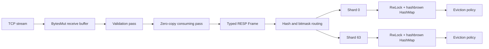

# Aether Cache


> High-throughput, highly concurrent, zero-copy in-memory analytical caching in Rust.

Aether Cache is a strictly typed RESP (Redis Serialization Protocol) TCP server engineered around multicore scalability, bounded cache capacity, and predictable memory behavior. The implementation combines asynchronous Tokio networking, transactional stream parsing, cache-line-aligned sharding, zero-copy binary payloads, and compile-time-pluggable eviction policies.

The server currently implements the RESP subset required for binary-safe `SET key value` and `GET key` operations. Its architecture deliberately avoids a cache-wide mutex: synchronization is partitioned across 64 independent shards, read metadata is buffered through lock-free queues, and payload ownership is transferred through `bytes::Bytes` rather than copied.

> **Status:** systems-engineering project and protocol/cache core. Persistence, replication, Redis command parity, authentication, and distributed operation are outside the current scope.

## Table of Contents

- [🏗️ Architecture & Systems Engineering](#️-architecture--systems-engineering)
  - [🌐 Zero-Copy Networking](#-zero-copy-networking)
  - [🧱 Cache-Line-Aligned Sharding](#-cache-line-aligned-sharding)
  - [🔌 Pluggable Eviction Architecture](#-pluggable-eviction-architecture)
  - [⚡ Amortized Lock-Free Reads with Strict LRU](#-amortized-lock-free-reads-with-strict-lru)
  - [📉 O(1) Sampled LFU](#-o1-sampled-lfu)
  - [🧠 Entry Layout and Memory Semantics](#-entry-layout-and-memory-semantics)
- [📊 Performance & Stability Benchmarks](#-performance--stability-benchmarks)
  - [Local TCP throughput](#local-tcp-throughput)
  - [High-cardinality memory stability](#high-cardinality-memory-stability)
  - [Correctness and concurrency coverage](#correctness-and-concurrency-coverage)
- [🚀 Quick Start / Usage](#-quick-start--usage)
  - [Prerequisites](#prerequisites)
  - [Build and run](#build-and-run)
  - [Use `redis-cli`](#use-redis-cli)
  - [Use `redis-py`](#use-redis-py)
  - [Stress client](#stress-client)
  - [Development validation](#development-validation)
- [📁 Source Layout](#-source-layout)
- [⚙️ Current Runtime Configuration](#️-current-runtime-configuration)

## 🏗️ Architecture & Systems Engineering



### 🌐 Zero-Copy Networking

Each accepted TCP connection runs in its own Tokio task. Incoming data is read directly into a reusable `bytes::BytesMut` allocation with `AsyncReadExt::read_buf`; the server does not introduce a temporary read buffer between the socket and parser.

RESP parsing is deliberately split into two phases:

1. **Validation pass:** recursively scans frame boundaries and verifies lengths, nesting, and CRLF terminators without mutating the receive buffer.
2. **Consumption pass:** runs only after the entire frame is available. Bulk payloads are detached with `BytesMut::split_to()` and converted with `.freeze()`.

This transaction-like design gives streaming correctness: a partial TCP frame returns `Ok(None)` and leaves every byte untouched for the next read. Once complete, the bulk payload becomes an immutable `Bytes` handle that shares the receive allocation. The payload is then moved through `Frame::BulkString`, into `CacheEntry`, and back to socket writes without duplicating its byte region.

`Bytes::clone()` is used only where independently owned handles are required. It performs an atomic reference-count increment rather than a payload allocation or byte-for-byte copy.

Additional parser safeguards include:

- Checked length arithmetic and strict CRLF validation.
- Transactional handling of incomplete nested arrays.
- A 128-level nesting limit against adversarial recursion.
- Binary-safe bulk strings; command names alone use ASCII case-insensitive matching.

### 🧱 Cache-Line-Aligned Sharding

The key space is partitioned across **64 shards**. Each `CacheShard<K, V, P>` owns:

- A `parking_lot::RwLock<hashbrown::HashMap<K, V>>`.
- An independent eviction-policy instance `P`.
- A bounded, lock-free read-event buffer.

Shard routing is a constant-time power-of-two mask:

```text
shard_index = hash(key) & (shard_count - 1)
```

With 64 shards, this resolves to `hash & 63`, avoiding integer division on the routing path. The shard count is validated as a non-zero power of two during construction.

`CacheShard` uses `#[repr(align(64))]`, guaranteeing at least conventional hardware cache-line alignment. Adjacent lock words therefore do not share a 64-byte cache line, preventing unrelated cores from repeatedly invalidating one another's lock state through false sharing. A contained type may impose stricter alignment on a particular platform; the tested invariant is alignment of **at least** 64 bytes.

There is no global map lock. Keys routed to different shards can be read or mutated independently, while `parking_lot::RwLock` permits concurrent readers within a shard. Every synchronous lock guard is scoped and dropped before network `.await` points, preventing Tokio tasks from suspending while retaining shard ownership.

### 🔌 Pluggable Eviction Architecture

Eviction is modeled as a Strategy Pattern through the `EvictionPolicy` trait:

```rust
pub trait EvictionPolicy {
    fn on_read(&self, key: Bytes);
    fn promote(&self, key: Bytes);
    fn evict(&self, map: &mut RwLockWriteGuard<'_, HashMap<Bytes, CacheEntry>>);
}
```

The cache is generic over the full policy type:

```rust
ShardedCache<K, V, P, S>
```

`P` is instantiated independently for every shard through a policy factory. Rust monomorphizes each concrete cache configuration, providing static dispatch with no virtual calls, trait-object allocation, or runtime policy tag on the command path. The hasher `S` is likewise generic; the executable uses `hashbrown::DefaultHashBuilder`.

The current executable selects `StrictLru`, while `SampledLfu` remains available as a secondary policy implementation.

### ⚡ Amortized Lock-Free Reads with Strict LRU

Exact access-order maintenance normally turns every GET into a write operation. Aether Cache avoids that bottleneck by separating read observation from policy maintenance.

Each shard contains a capacity-128 `crossbeam_queue::ArrayQueue<Bytes>`. After the shard read guard is released, GET performs a non-blocking queue push containing only a cheap `Bytes` key handle. As long as capacity remains, readers do not acquire the shard write lock or the LRU ordering lock.

When the queue is full, one reader becomes the maintenance participant:

1. It acquires the shard write lock.
2. It promotes the rejected event and drains the 128 queued events.
3. It applies the entire access-order batch to `StrictLru`.
4. It executes capacity eviction before releasing the guard.

This converts up to 129 individual metadata updates into one write-lock acquisition. Under read-heavy multicore workloads, concurrent tasks remain on the lock-free enqueue path while maintenance cost is amortized across a batch.

`StrictLru` stores chronological keys in a `VecDeque<Bytes>`. Promotion appends to the back; eviction pops from the front and skips stale records whose keys have already disappeared from the map. Interior policy mutation uses `parking_lot::Mutex`, not `std::sync::Mutex` and not a cache-wide lock.

### 📉 O(1) Sampled LFU

`SampledLfu` provides a maintenance-free alternative inspired by Redis `maxmemory-policy allkeys-lfu`. Every `CacheEntry` carries a saturating `AtomicU32` access counter updated with `Ordering::Relaxed`; frequency accounting does not publish payload memory and therefore requires no stronger ordering.

When a shard exceeds capacity, the policy evaluates:

```rust
map.iter()
    .take(5)
    .min_by_key(|(_, entry)| entry.access_count())
```

`hashbrown`'s randomized table layout makes the first five iteration candidates an inexpensive bounded sample. Because sample size is constant, victim selection is O(1) with respect to cache size and requires no heap, global frequency list, timer, or background maintenance thread. The selected key is removed and sampling repeats only until the shard returns to its target capacity.

### 🧠 Entry Layout and Memory Semantics

`CacheEntry` uses `#[repr(C)]` and stores:

- `Bytes` key and value handles.
- Optional absolute expiration in Unix epoch milliseconds.
- A saturating `AtomicU32` access counter.

TTL arithmetic is saturating, and expiration reads do not require exclusive shard access. Payload retrieval clones only the immutable `Bytes` handle before dropping the shard read guard, allowing socket I/O to proceed safely without pinning the map lock.

Total capacity is divided across shards at construction. This gives each partition an independent target and keeps eviction local to the contended shard. The design targets a stable memory envelope under high-cardinality workloads; process memory also includes allocator slack, hash-table capacity, socket buffers, parser buffers, and queued metadata.

## 📊 Performance & Stability Benchmarks

### Local TCP throughput

A single-threaded Python client issuing pipelined RESP commands over loopback has measured approximately:

> **~40,000 operations/second**

This result measures the complete path: Python serialization, local TCP, Tokio scheduling, two-phase RESP parsing, shard routing, map mutation, eviction checks, and response draining. It is an observed development-system result, not a hardware-independent guarantee. Compiler version, CPU topology, Windows networking, command mix, key/value size, pipeline depth, and active eviction policy materially affect throughput.

### High-cardinality memory stability

A sustained stress run blasted **20,000,000 unique keys** through the bounded cache. During the verified run, resident memory reached a plateau rather than growing linearly with key cardinality; eviction continued under pressure and the operating-system OOM killer was not triggered.

The included `script.py` is configured for an even larger 50,000,000-command SET workload and sends commands in bounded client-side batches. Run it only with a cache policy/workload combination that can continuously nominate victims, while monitoring RSS and response progress. “OOM-immunity” here means capacity-driven resistance to unbounded cache growth under the tested workload, not immunity to every allocator failure or malicious protocol input.

### Correctness and concurrency coverage

The automated suite covers:

- Zero-copy bulk-string extraction with backing-pointer identity verification.
- Incomplete-frame rollback and malformed CRLF rejection.
- Nested RESP arrays.
- Cache-line alignment.
- Sixteen native writer threads inserting 160,000 unique records.
- Sampled-LFU victim selection and capacity trimming.
- Strict-LRU chronological eviction and stale-event handling.
- Pipelined SET/GET over a real loopback TCP connection.
- Read-buffer overflow and batched maintenance draining.

Run the optimized suite when evaluating concurrency behavior:

```bash
cargo test --release --all-features
```

## 🚀 Quick Start / Usage

### Prerequisites

- Rust 1.85 or newer for Edition 2024.
- Cargo, installed through [rustup](https://rustup.rs/).
- Optional: `redis-cli` or Python 3 with `redis-py`.

### Build and run

```bash
git clone <repository-url>
cd aether-cache
cargo build --release
cargo run --release
```

The server listens on `0.0.0.0:6379`, the conventional Redis port:

```text
aether-cache server started on port 6379
```

If startup reports an address-in-use error, stop the existing Redis/Aether process bound to port 6379 before retrying.

### Use `redis-cli`

```bash
redis-cli -h 127.0.0.1 -p 6379 SET portfolio:project aether-cache
redis-cli -h 127.0.0.1 -p 6379 GET portfolio:project
```

Expected output:

```text
OK
"aether-cache"
```

An interactive session works as well:

```bash
redis-cli -h 127.0.0.1 -p 6379
127.0.0.1:6379> SET key value
OK
127.0.0.1:6379> GET key
"value"
```

Only RESP bulk-string arrays containing `SET key value` and `GET key` are currently supported. Other commands return `-ERR unknown command`.

### Use `redis-py`

Install the client:

```bash
python -m pip install redis
```

```python
import redis

client = redis.Redis(
    host="127.0.0.1",
    port=6379,
    protocol=2,
    decode_responses=False,
)

client.set(b"analytical:key", b"zero-copy-payload")
value = client.get(b"analytical:key")
print(value)  # b'zero-copy-payload'
```

RESP2 is selected explicitly because the server intentionally implements a focused RESP2 command subset rather than Redis handshake, RESP3 negotiation, or metadata commands.

### Stress client

With the release server running in another terminal:

```bash
python script.py
```

The script uses a single persistent socket, large OS socket buffers, pipelined SET frames, bounded Python-side batches, and complete response draining. Adjust `TOTAL_COMMANDS` and `BATCH_SIZE` for the available test machine before running.

### Development validation

```bash
cargo fmt --check
cargo check --all-targets
cargo clippy --all-targets --all-features -- -D warnings
cargo test --all-features
```

## 📁 Source Layout

```text
src/
├── entry.rs      # CacheEntry layout, TTL checks, and atomic frequency metadata
├── eviction.rs   # EvictionPolicy, lock-free ReadBuffer, StrictLru, SampledLfu
├── frame.rs      # Strictly typed RESP frame model
├── lib.rs        # Public library modules
├── main.rs       # StrictLru server configuration and Tokio entrypoint
├── parse.rs      # Transactional two-phase zero-copy RESP parser
├── server.rs     # Async TCP accept loop and SET/GET execution
└── shard.rs      # Cache-line-aligned generic sharding engine
```

## ⚙️ Current Runtime Configuration

| Parameter | Value |
|---|---:|
| TCP port | `6379` |
| Shards | `64` |
| Total configured entries | `1,000,000` |
| Read events per shard batch | `128` |
| Executable eviction policy | `StrictLru` |
| Hash builder | `hashbrown::DefaultHashBuilder` |
| Parser nesting limit | `128` |

---

Aether Cache is an exploration of practical systems design: explicit memory ownership, mechanically enforced lock lifetimes, cache-aware data layout, bounded approximation algorithms, and asynchronous protocol execution composed without a global synchronization bottleneck.
